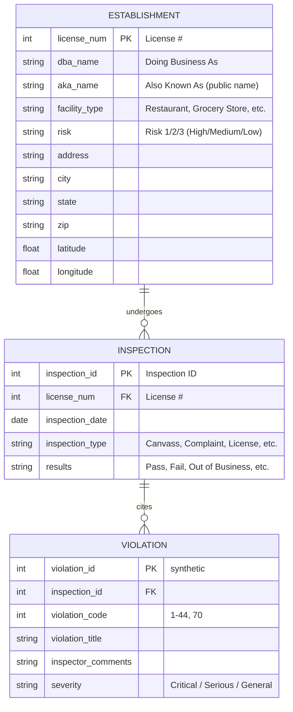

# Phase-I Report — Section 1: Description of Dataset D

**Dataset:** Chicago Food Inspection (CFI)  
**Source:** [Chicago Data Portal — Food Inspections](https://data.cityofchicago.org/Health-Human-Services/Food-Inspections/4ijn-s7e5)  
**API endpoint:** `https://data.cityofchicago.org/resource/4ijn-s7e5.json`  
**Profiled on:** July 3, 2026  
**Total rows (live portal):** 312,740

---

## 1a. Conceptual Model (ER Diagram)

The CFI dataset describes **food-establishment inspections** conducted in Chicago. Conceptually, the domain has three entity types:

1. **Establishment** — a licensed food facility (restaurant, grocery, school kitchen, etc.)
2. **Inspection** — a single visit by a health inspector to an establishment on a given date
3. **Violation** — an individual code cited during an inspection (optional; zero or more per inspection)

In the **raw CSV**, all information is stored in one denormalized table: establishment attributes are repeated on every inspection row, and multiple violations are concatenated into a single free-text field.

### ER Diagram



### Relationship summary

| Relationship | Cardinality | Notes |
|---|---|---|
| Establishment → Inspection | 1 : N | One license may have hundreds of inspections over time |
| Inspection → Violation | 1 : N | Parsed from the `Violations` text field in raw data |
| Inspection ID → Establishment | N : 1 | Each inspection belongs to exactly one licensed establishment |

---

## 1a (continued). Relational Database Schema

### Raw / physical schema (as delivered by the portal)

This is the structure of dataset **D** as downloaded from the portal (17 core columns).

| # | Column Name | SODA Field | Data Type | Nullable | Description |
|---|---|---|---|---|---|
| 1 | Inspection ID | `inspection_id` | INTEGER | NO | Unique identifier for each inspection event (primary key) |
| 2 | DBA Name | `dba_name` | TEXT | NO | Legal “Doing Business As” name of the establishment |
| 3 | AKA Name | `aka_name` | TEXT | YES | Public-facing name; may differ from DBA |
| 4 | License # | `license_` | INTEGER | NO | License number assigned by Chicago BACP; identifies the establishment |
| 5 | Facility Type | `facility_type` | TEXT | YES | Category: Restaurant, Grocery Store, School, etc. |
| 6 | Risk | `risk` | TEXT | YES | Health-risk tier: Risk 1 (High), Risk 2 (Medium), Risk 3 (Low) |
| 7 | Address | `address` | TEXT | NO | Street address of the facility |
| 8 | City | `city` | TEXT | NO | City name (almost always `CHICAGO`) |
| 9 | State | `state` | TEXT | NO | State abbreviation (almost always `IL`) |
| 10 | Zip | `zip` | TEXT/NUM | NO | ZIP code |
| 11 | Inspection Date | `inspection_date` | DATE | NO | Date the inspection was performed |
| 12 | Inspection Type | `inspection_type` | TEXT | NO | Trigger: Canvass, Complaint, License, Re-Inspection, etc. |
| 13 | Results | `results` | TEXT | NO | Outcome: Pass, Pass w/ Conditions, Fail, Out of Business, etc. |
| 14 | Violations | `violations` | TEXT | YES | Pipe-separated (`\|`) free-text list of violation narratives |
| 15 | Latitude | `latitude` | FLOAT | YES | Geocoded latitude |
| 16 | Longitude | `longitude` | FLOAT | YES | Geocoded longitude |
| 17 | Location | `location` | JSON/POINT | YES | Combined geospatial object (lat/long + empty human_address) |

### Normalized / logical schema (target for analysis)

For our main use case U1, we plan to transform **D** into a cleaner logical model:

```sql
-- Establishment (one row per License #)
CREATE TABLE establishment (
    license_num     INTEGER PRIMARY KEY,
    dba_name        TEXT NOT NULL,
    aka_name        TEXT,
    facility_type   TEXT,
    risk_level      INTEGER CHECK (risk_level IN (1, 2, 3)),
    address         TEXT,
    city            TEXT,
    state           TEXT,
    zip             TEXT,
    latitude        REAL,
    longitude       REAL
);

-- Inspection (one row per Inspection ID)
CREATE TABLE inspection (
    inspection_id     INTEGER PRIMARY KEY,
    license_num       INTEGER REFERENCES establishment(license_num),
    inspection_date   DATE NOT NULL,
    inspection_type   TEXT NOT NULL,
    results           TEXT NOT NULL,
    is_operational    BOOLEAN  -- FALSE for Out of Business, Not Ready, etc.
);

-- Violation (one row per cited violation code per inspection)
CREATE TABLE violation (
    violation_id        INTEGER PRIMARY KEY,
    inspection_id       INTEGER REFERENCES inspection(inspection_id),
    violation_code      INTEGER,
    violation_title     TEXT,
    inspector_comments  TEXT,
    severity            TEXT  -- Critical (1-14), Serious (15-29), General (30+)
);
```

### Key integrity constraints (for Phase-II)

| ID | Constraint | Rationale |
|---|---|---|
| IC1 | `inspection_id` is unique | Each row is one inspection event |
| IC2 | `license_num` NOT NULL on every inspection | Every inspection belongs to a licensed establishment |
| IC3 | `results = 'Fail'` → `violations` NOT NULL | A failed inspection should cite at least one violation |
| IC4 | `results IN ('Pass','Pass w/ Conditions','Fail', ...)` | Results must come from a controlled vocabulary |
| IC5 | `risk_level IN (1,2,3)` | Risk must be parseable for filtering |
| IC6 | `facility_type` NOT NULL for operational establishments | Needed to filter “restaurants” in U1 |

---

## 1b. Narrative Description of the Dataset

### Origin and stewardship

The Chicago Food Inspection dataset is published by the **City of Chicago** on its open data portal. The data originates from inspections performed by the **Chicago Department of Public Health (CDPH) Food Protection Program**. Inspectors follow a standardized procedure; results are entered into a database and reviewed by a **State of Illinois Licensed Environmental Health Practitioner (LEHP)** before publication.

The dataset is one of two options for the CS 513 group project and is widely used in public-health informatics and data-cleaning coursework because it combines relatively clean tabular structure with rich, messy free-text fields.

### What the data represents

Each row in the dataset represents **one inspection event** — a single visit by a health inspector to a licensed food establishment on a specific date. A single establishment (identified by `License #`) typically appears on many rows because facilities are re-inspected on a schedule determined by their risk category:

- **Risk 1 (High):** inspected most frequently (e.g., restaurants)
- **Risk 2 (Medium):** moderate frequency
- **Risk 3 (Low):** inspected least frequently

An inspection records the **type** of visit (routine canvass, complaint response, license inspection, re-inspection, etc.), the **outcome** (`Results`), and any **violations** found. Violations reference a numbered codebook (codes 1–44 and 70); in the raw data they appear as long narrative strings rather than normalized rows.

### Temporal extent

| Attribute | Value |
|---|---|
| Earliest inspection | January 4, 2010 |
| Latest inspection | July 2, 2026 (at time of profiling) |
| Update frequency | Daily (portal is continuously updated) |
| Total records | 312,740 inspection events |

The long time span makes the dataset suitable for trend analysis, but also introduces schema drift (e.g., facility-type labels that changed over the years).

### Spatial extent

The data covers **food establishments located in Chicago, Illinois**. Nearly all records have `City = CHICAGO` and `State = IL`. Geocoordinates (`Latitude`, `Longitude`) are provided for most records (~99.7%), enabling mapping and neighborhood-level aggregation. A small number of records (~1,035) lack coordinates despite having a street address.

### Content summary

At the time of profiling, the dataset contains:

| Results value | Count | Share |
|---|---|---|
| Pass | 161,822 | 51.7% |
| Fail | 60,224 | 19.3% |
| Pass w/ Conditions | 46,459 | 14.9% |
| Out of Business | 25,697 | 8.2% |
| No Entry | 13,956 | 4.5% |
| Not Ready | 4,487 | 1.4% |
| Business Not Located | 95 | <0.1% |

The most common **facility types** are Restaurant (212,106), Grocery Store (37,555), and School (19,511). **Risk 1 (High)** accounts for 232,553 records (74.3%).

### Known limitations (from portal metadata)

The City of Chicago explicitly notes:

1. **Possible duplicate inspection reports** may remain in the dataset despite deduplication efforts. Our profiling confirms extreme cases (e.g., 57 identical rows for one license on one date).
2. **Results and violations reflect inspector findings at the time of inspection** and may not represent the establishment’s current status.
3. The `Violations` field is **semi-structured text**, not a normalized relational child table.

These limitations are directly relevant to our Phase-II data cleaning plan and main use case U1.

---

## Suggested figures for the PDF report

1. **Figure 1:** ER diagram (Mermaid export or draw.io)
2. **Table 1:** Raw 17-column schema (above)
3. **Table 2:** Results distribution and date range summary
