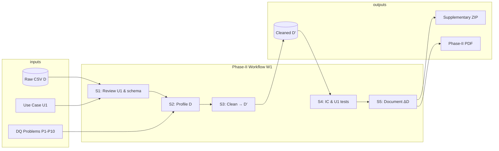

# Phase-I Report — Section 4: Initial Plan for Phase-II

**Dataset:** Chicago Food Inspection (CFI)  
**Main use case:** U1 — Risk 1 restaurant failure rates by ZIP (2023–2025) + top 10 violation codes  
**Team:** *[Fill in Team-ID, member names, Illinois emails]*

---

## Overview

This plan outlines how we will transform raw dataset **D** (312,740 rows from the Chicago Data Portal) into cleaned dataset **D′** that supports use case **U1**. The workflow follows the course template S1–S5 and maps each step to the data quality problems P1–P10 identified in Section 3.

### Tools

| Tool | Role in workflow |
|---|---|
| **OpenRefine** | Interactive faceting, clustering, bulk transforms, reproducible recipe |
| **Python (pandas)** | Violation parsing, deduplication, validation scripts |
| **SQL (SQLite or PostgreSQL)** | Profiling queries, IC violation checks, before/after Q1/Q2 |
| **YesWorkflow** | Outer workflow model W1 (Phase-II deliverable) |
| **OR2YW** | Inner OpenRefine workflow visualization (Phase-II deliverable) |

### Data snapshot

- Download CSV from course Box folder (or portal export) on **Day 1 of Phase-II**
- Record download date, row count, and file hash in `DataLinks.txt`
- Keep raw **D** immutable; all cleaning produces new files

---

## S1: Review and Update Dataset / Use Case Descriptions

| Item | Detail |
|---|---|
| **Goal** | Confirm U1, schema, and DQ problem list still match the downloaded snapshot |
| **Actions** | Re-run row-count and `Results` distribution queries; update counts if portal changed; finalize U1 date window (2023–2025) |
| **Output** | Updated Section 1–3 text (if counts changed); signed-off U1 query definitions |
| **Owner** | *[Member A]* |
| **Done when** | Team agrees U1 queries are frozen and raw CSV is saved |

---

## S2: Profile D to Identify Quality Problems P

| Item | Detail |
|---|---|
| **Goal** | Systematically measure all P1–P10 problems on our snapshot |
| **Actions** | |

### Profiling tasks

| Task | Tool | Query / method | Maps to |
|---|---|---|---|
| Column null rates | SQL | `queries/profiling-queries.txt` B1 | P2, P4, P5, P8 |
| Results distribution | OpenRefine facet | Text facet on `Results` | P1 |
| Fail without violations | SQL | B3 | P2 |
| Duplicate groups | SQL | B5 | P6 |
| Risk anomalies | OpenRefine facet | Text facet on `Risk` | P5 |
| Facility type blanks | OpenRefine facet | Blank count on `Facility Type` | P4 |
| Violation text samples | Manual + Python | Regex `^(\d+)\.` on 1,000 rows | P3 |
| Pass + violation rows | SQL | A12 / B1 variant | P10 |
| Address patterns | Python | Regex for ranges `(\\d+-\\d+)` | P9 |

### Profiling outputs

1. **Profiling summary table** (null %, duplicate count, IC violations per constraint)
2. **Screenshots** for report (OpenRefine facets)
3. **`queries.txt`** committed to supplementary ZIP

| **Owner** | *[Member B]* — SQL profiling; *[Member C]* — OpenRefine facets |
| **Done when** | Every P1–P10 problem has a measured count on our snapshot |

---

## S3: Perform Data Cleaning to Produce D′

High-level cleaning pipeline (inner workflow **W2**):

```
D (raw CSV)
  │
  ├─[3a] Load & snapshot ──────────────────────────────────────────────
  │
  ├─[3b] Filter / flag operational results (P1) ─────────────────────── OpenRefine
  │         Add column: is_operational (TRUE/FALSE)
  │
  ├─[3c] Deduplicate inspections (P6) ─────────────────────────────── Python
  │         Key: inspection_id (primary) or (license, date, dba, results)
  │
  ├─[3d] Normalize Risk & Facility Type (P4, P5) ──────────────────── OpenRefine
  │         Parse risk_level 1/2/3; impute or drop null facility_type
  │
  ├─[3e] Parse Violations into violation table (P3, P10) ──────────── Python
  │         Split on " | "; extract code, title, comments, severity
  │
  ├─[3f] Handle incomplete Fail rows (P2) ─────────────────────────── Python
  │         Flag rows where results='Fail' AND violations IS NULL
  │
  ├─[3g] Normalize establishment attributes (P7, P9) ────────────────── OpenRefine
  │         Trim names; optional: cluster DBA/AKA (documentation only)
  │
  └─[3h] Export D′ ────────────────────────────────────────────────────
            establishment.csv, inspection.csv, violation.csv
            (or single denormalized cleaned CSV)
```

### Step-by-step detail

#### 3b. Operational result flag (P1) — OpenRefine

```
# GREL expression for new column is_operational
if(
  value == "Pass" or value == "Fail" or value == "Pass w/ Conditions",
  "TRUE", "FALSE"
)
```

Non-operational values to flag FALSE: `Out of Business`, `No Entry`, `Not Ready`, `Business Not Located`.

#### 3c. Deduplication (P6) — Python

```python
# Keep first row per inspection_id; log dropped duplicates
df_dedup = df.drop_duplicates(subset=["Inspection ID"], keep="first")
# Secondary check: (License #, Inspection Date, DBA Name, Results)
```

#### 3d. Risk normalization (P5) — OpenRefine

```
# GREL: parse risk_level from Risk column
if(value == "Risk 1 (High)", 1,
  if(value == "Risk 2 (Medium)", 2,
    if(value == "Risk 3 (Low)", 3, null)))
```

Quarantine rows where `risk_level` is null or `Risk = "All"`.

#### 3e. Violation parsing (P3) — Python

```python
import re
PATTERN = re.compile(r"(\d+)\.\s+([^-|]+)(?:\s*-\s*Comments:\s*(.+))?", re.DOTALL)

def parse_violations(text):
    if pd.isna(text): return []
    return PATTERN.findall(text)  # list of (code, title, comments)
```

Assign severity from code ranges: 1–14 Critical, 15–29 Serious, 30+ General (handles P10).

#### 3f. Incomplete Fail flag (P2) — Python

Add `incomplete_violation_record = TRUE` where `Results = 'Fail'` and `Violations` is null. Exclude from Q2 ranking or keep with warning.

### Task assignment (fill in names)

| Step | Task | Owner | Tool |
|---|---|---|---|
| 3b | Operational flag | *[Member C]* | OpenRefine |
| 3c | Deduplication | *[Member B]* | Python |
| 3d | Risk / facility type | *[Member C]* | OpenRefine |
| 3e | Violation parsing | *[Member B]* | Python |
| 3f | Incomplete Fail flag | *[Member B]* | Python |
| 3g | Name/address trim | *[Member D]* | OpenRefine |
| 3h | Export & upload | *[Member A]* | All |

### Phase-II provenance deliverables

- `OpenRefineHistory.json` — export from OpenRefine
- `profile_cfi.py` / `clean_cfi.py` — Python scripts
- `Workflow.yw` + `Workflow.gv` — YesWorkflow outer model

| **Done when** | D′ uploaded to Box; scripts and OpenRefine history in supplementary ZIP |

---

## S4: Data Quality Checking — Is D′ Really Cleaner Than D?

| Item | Detail |
|---|---|
| **Goal** | Prove D′ supports U1 and P1–P6 are resolved or reduced |
| **Actions** | |

### Before/after test suite

| Test | Before (D) | After (D′) | Pass criterion |
|---|---|---|---|
| IC1: Unique inspection_id | Count duplicates | 0 duplicates | Dedup works |
| IC2: Fail → violations | 3,628 violations | 0 (or flagged only) | P2 resolved |
| IC3: Operational filter | 44,235 non-op rows in U1 set | 0 in U1 set | P1 resolved |
| IC4: Risk parseable | 175 anomalies | 0 in U1 set | P5 resolved |
| IC5: Violation codes extractable | Q2 returns 0 rows | Q2 returns 10 codes | P3 resolved |
| U1 Q1 | Naive vs cleaned ZIP table | Material rank changes | Document delta |
| U1 Q2 | Cannot run | Top-10 table populated | U1 supported |

### Demo queries

Run `queries/profiling-queries.txt` B7 (U1 scope) and B8 (naive Q1) on D, then equivalent on D′. Include side-by-side results table in Phase-II report.

### Test examples for report

1. **ZIP 60620 failure rate** — before vs after (show denominator change when excluding Out of Business)
2. **License 1354323** — 57 duplicate rows → 1 row
3. **PATIO inspection** — one `Violations` cell → 2 rows in `violation` table (codes 3 and 38)

| **Owner** | *[Member A]* — run SQL tests; *[Member D]* — write narrative |
| **Done when** | All IC tests documented with before/after counts |

---

## S5: Document and Quantify Changes ΔD

| Item | Detail |
|---|---|
| **Goal** | Summarize every change from D → D′ |
| **Actions** | |

### Change summary table (template)

| Metric | D (raw) | D′ (cleaned) | Δ |
|---|---|---|---|
| Total inspection rows | 312,740 | *TBD* | *TBD* |
| Duplicate rows removed | — | — | *TBD* |
| Rows flagged non-operational | 0 | 44,235 | +44,235 flagged |
| Violation rows (normalized) | 0 | *TBD* | new table |
| Cells changed (OpenRefine) | 0 | *TBD* | from history |
| IC2 violations (Fail w/o violations) | 3,628 | *TBD* | target → 0 |
| IC6 violations (null facility_type in U1 set) | *TBD* | *TBD* | target → 0 |

### Quantification methods

| Source | What to extract |
|---|---|
| OpenRefine history | `cellsChanged`, `rowsRemoved`, operation list |
| Python scripts | Log lines: `dropped_duplicates=N`, `parsed_violations=M` |
| SQL diff | `COUNT(*)` per table before/after |

### Phase-II report sections fed by S5

- Change summary table (Phase-II §2)
- Lessons learned (Phase-II §4)
- `DataLinks.txt` with Box URLs for D and D′

| **Owner** | *[Member D]* — compile table; all members verify |
| **Done when** | ΔD table complete and Box links live |

---

## Tentative timeline

*Adjust dates to match your course Key Dates posting.*

| Phase | Tasks | Target |
|---|---|---|
| **Week 1** | S1 review + S2 profiling | Profiling complete, screenshots done |
| **Week 2** | S3a–3d OpenRefine cleaning | OpenRefineHistory.json exported |
| **Week 3** | S3e–3h Python parsing + export | D′ on Box |
| **Week 4** | S4 testing + S5 quantification | Before/after queries run |
| **Week 5** | Phase-II report + supplementary ZIP | Final submission |

---

## Workflow diagram (outer W1 — for Phase-II)



---

## Risk register

| Risk | Mitigation |
|---|---|
| Portal data changes between Phase-I and Phase-II | Freeze CSV on Day 1; note download date |
| Violation regex fails on edge cases | Manual review of 50 unparsed rows; iterate regex |
| OpenRefine chokes on 300K+ rows | Use Python for heavy steps; OpenRefine on sample or filtered subset |
| Team member unavailable | Cross-train on OpenRefine recipe + Python script (document in README) |

---

## Phase-I checklist (all four sections)

- [x] **Section 1** — Dataset description (`docs/phase1-step1-dataset-description.md`)
- [x] **Section 2** — Use cases U0, U1, U2 (`docs/phase1-step2-use-cases.md`)
- [x] **Section 3** — DQ problems (`docs/phase1-step3-data-quality.md`)
- [x] **Section 4** — Phase-II plan (`docs/phase1-step4-phase2-plan.md`)
- [ ] Team header (ID, names, emails) added to PDF
- [ ] Screenshots embedded in PDF
- [ ] Final PDF submitted once on Coursera
